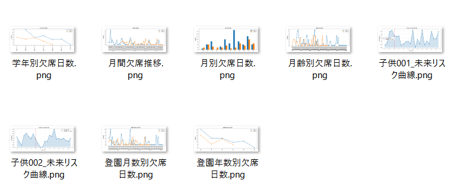
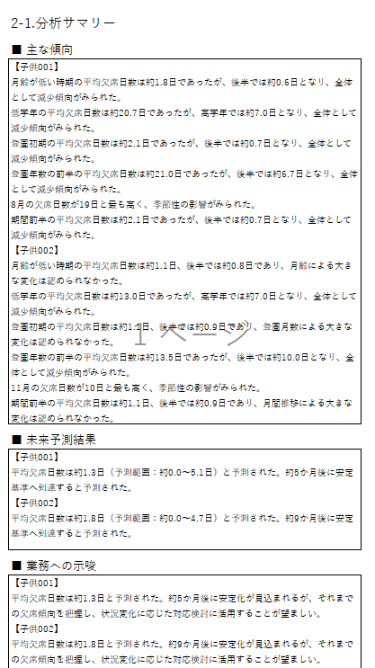
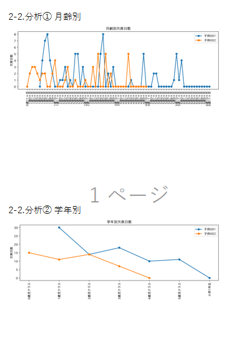
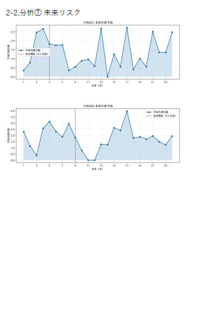
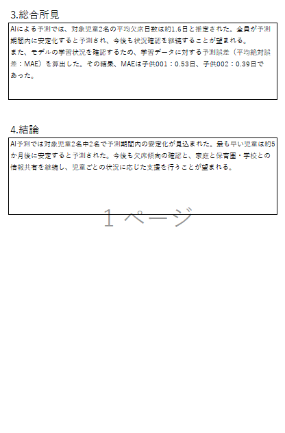

# AI欠席予測・分析レポート自動生成システム

## 概要

保育園児の過去の欠席データを分析し、
AI（LightGBM）を用いて今後24か月間の欠席日数を予測するシステムです。

分析結果はグラフとして可視化し、
予測結果や統計情報をExcel報告書として自動生成することで、
分析結果の共有や報告業務の効率化を実現しました。

職業訓練校の卒業制作として作成しました。

---

## システム構成

```
Excelデータ
      │
      ▼
前処理(data_processing.py)
      │
      ▼
特徴量生成(feature_engineering.py)
      │
      ▼
LightGBM学習(train_model.py)
      │
      ▼
未来24か月予測(predict.py)
      │
      ▼
グラフ生成(visualization.py)
      │
      ▼
文章生成(text_builder.py)
      │
      ▼
Excelレポート出力(report_generator.py)
```

---

## 使用技術

- Python 3
- pandas
- numpy
- LightGBM
- matplotlib
- openpyxl
- japanize-matplotlib

---

## ディレクトリ構成

```
absence-prediction
│
├── data
│   └── 欠席.xlsx
│
├── template
│   └── 報告書ひな形.xlsx
│
├── output
│   ├── graphs
│   └── reports
│
├── config.py
├── main.py
├── generate_data.py
├── data_processing.py
├── feature_engineering.py
├── train_model.py
├── predict.py
├── visualization.py
├── text_builder.py
├── report_generator.py
├── excel_writer.py
└── cell_map.py
```

---

## 主な機能

### ① データ前処理

Excelデータを読み込み、
分析用データと機械学習用データへ加工します。

---

### ② 特徴量生成

過去6か月の欠席データから、機械学習で利用する8種類の特徴量を生成しています。

- 平均欠席日数
- 標準偏差
- 最大欠席日数
- 最小欠席日数
- 欠席日数の増減傾向（最新月 − 最初の月）
- 最新月と平均値の差
- 欠席日数が増加した回数
- 欠席日数が減少した回数

---

### ③ AI学習

LightGBMを使用して
児童ごとの欠席傾向を学習します。

---

### ④ 未来予測

学習済みモデルを利用し、
24か月先までの欠席日数を予測します。

また、

- 平均欠席日数
- 安定化までの月数

も算出しています。

---

### ⑤ グラフ作成

以下のグラフを自動生成します。

- 月齢別欠席日数
- 学年別欠席日数
- 登園月数別欠席日数
- 登園年数別欠席日数
- 月間推移
- 月別欠席日数
- AI未来予測グラフ



---

### ⑥ レポート自動生成

Excelテンプレートへ

- グラフ
- 分析文章
- AI予測
- 総合所見

を自動配置し、
分析報告書を完成させます。



---

## 工夫した点

### 責務を分離した設計

前処理・学習・予測・グラフ生成・Excel出力を
それぞれ独立したモジュールへ分割し、
変更が他モジュールへ影響しにくい構成としました。

| ファイル            | 役割       |
| ------------------- | ---------- |
| data_processing     | 前処理     |
| feature_engineering | 特徴量生成 |
| train_model         | 学習       |
| predict             | 未来予測   |
| visualization       | グラフ作成 |
| text_builder        | 文章生成   |
| report_generator    | 帳票制御   |
| excel_writer        | Excel操作  |

保守性・再利用性を考慮した設計としています。

---

### レイアウト変更に強い設計

Excelのセル位置を

```
CELL_MAP
```

で一元管理しています。

テンプレート変更時でも
プログラム本体を修正せずに対応できるよう設計しました。

---

### Excel操作のカプセル化

openpyxlを直接扱わず、Excel操作を `ExcelWriter` クラスへ集約しました。

これにより

- セル書き込み
- 表データの書き込み
- 画像の貼り付け

を共通化し、レポート生成側はExcelの実装を意識せず利用できる設計としています。

---

### 自然な文章生成

分析結果を数値だけではなく

- 傾向分析
- AI予測
- 業務改善提案
- 総合所見

として自動生成しています。

---

## 実行方法

必要ライブラリをインストールします。

```
pip install pandas numpy matplotlib lightgbm openpyxl japanize-matplotlib
```

実行します。

```
python main.py
```

---

## 出力例

実行すると

```
output/
├── graphs
│    ├── 月齢別欠席日数.png
│    ├── 学年別欠席日数.png
│    ├── ...
│
└── reports
      └── 20260707_欠席分析報告書.xlsx
```

が生成されます。

---

## 学んだこと

本制作では

・Pythonによるデータ分析
・LightGBMによる機械学習
・openpyxlによるExcel自動生成
・責務分離を意識した設計

を実践的に学びました。

今後はモデル評価や特徴量重要度の可視化なども取り入れ、
より精度の高い分析システムへ改善していきたいと考えています。

---

## 今後の改善・拡張項目

現在のシステムをさらに発展させる場合、以下の改善が考えられます。

- モデル評価の高度化（時系列交差検証、RMSEによる追加評価）
- モデルの解釈性向上（SHAPによる予測根拠の可視化）
- 月齢・登園月数・季節性などの特徴量追加による予測精度向上
- データ連携による分析範囲拡張
- GUI化

---

## 制作期間

約2週間（卒業制作）

---

## 制作者

谷口 奈々
